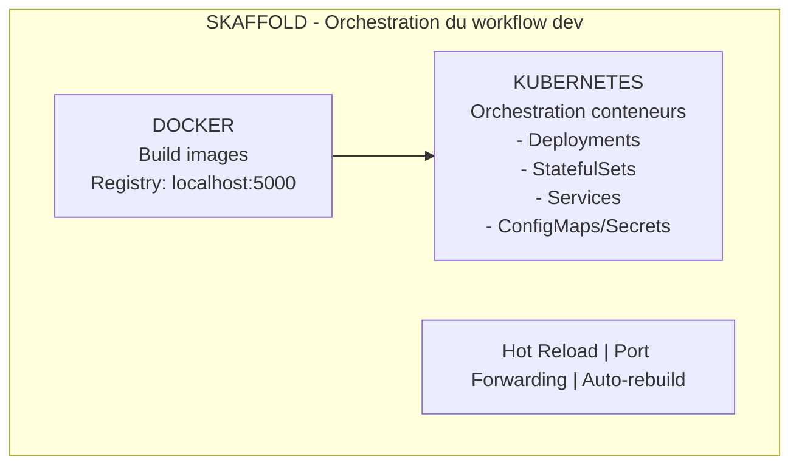

# Infrastructure de Développement

## Vue d'Ensemble

Ce projet utilise une stack moderne pour le développement d'applications conteneurisées :



### Workflow de Développement

1. **Développement local** : Écrire du code dans votre IDE
2. **Build automatique** : Docker construit l'image à chaque modification
3. **Déploiement auto** : Kubernetes déploie la nouvelle version
4. **Hot Reload** : Skaffold synchronise les fichiers sans rebuild complet
5. **Accès immédiat** : Port forwarding automatique vers localhost

**Important** : Cette infrastructure de développement est conçue pour s'adapter facilement à la production. Les manifests Kubernetes restent identiques, seules les configurations (ConfigMaps, Secrets, images registry) changent entre les environnements.

---

## Docker - Containerisation

### Qu'est-ce que Docker ?

### Rôle dans le Projet
- **Containerisation** : Empaqueter chaque application (API, base de données) avec ses dépendances
- **Isolation** : Chaque conteneur s'exécute de manière isolée
- **Portabilité** : Les mêmes images fonctionnent en dev, staging et production

### Configuration Dev
- **Registry locale** : `localhost:5000`
- Les images sont construites et poussées automatiquement par Skaffold
- Tag `latest` utilisé pour forcer le téléchargement des nouvelles versions

---

## Kubernetes - Orchestration

### Qu'est-ce que Kubernetes ?
Kubernetes (K8s) est un système d'orchestration de conteneurs qui automatise le déploiement, la mise à l'échelle et la gestion des applications conteneurisées.

### Rôle dans le Projet
- **Orchestration** : Gérer le cycle de vie des conteneurs
- **Scaling** : Ajuster automatiquement le nombre de replicas
- **Self-healing** : Redémarrer les conteneurs défaillants
- **Service Discovery** : Permettre aux applications de communiquer entre elles

### Organisation des Manifests

Le projet organise les manifests Kubernetes par type de ressource :

```
infra/
├── deployment/          # Applications stateless
├── statefulset/         # Applications stateful
├── service/             # Exposition réseau
├── configmap/           # Configuration
└── secret/              # Données sensibles
```

#### Types de Ressources

- **Deployment** : Pour les applications stateless qui peuvent avoir plusieurs replicas identiques
- **StatefulSet** : Pour les applications stateful nécessitant un stockage persistant et une identité stable
- **Service** : Expose les pods via le réseau (ClusterIP interne, ou Headless pour StatefulSet)
- **ConfigMap** : Stocke la configuration non-sensible (URLs, ports, noms de DB)
- **Secret** : Stocke les données sensibles (mots de passe, tokens)

---

## Skaffold - Workflow de Développement

### Qu'est-ce que Skaffold ?
Skaffold est un outil de développement qui automatise le cycle build/push/deploy pour les applications Kubernetes.

### Rôle dans le Projet
- **Automatisation complète** : Du code source au déploiement K8s
- **Développement continu** : Reconstruit et redéploie à chaque modification
- **Synchronisation rapide** : Hot reload sans rebuild complet pour les petits changements

### Fonctionnalités Clés

#### 1. Build Automatique
- Détecte les modifications de fichiers (src/, package.json, Dockerfile)
- Build l'image Docker automatiquement
- Push vers la registry locale

#### 2. Hot Reload (File Sync)
- Synchronise directement les fichiers `.ts` et `.js` dans le conteneur
- Évite un rebuild complet pour les petites modifications
- Accélère considérablement le cycle de développement

#### 3. Port Forwarding
Expose automatiquement les services sur localhost :
- API : `localhost:3000` → `api-capteur-service:3000`
- PostgreSQL : `localhost:5432` → `postgis:5432`

#### 4. Logs Centralisés
Affiche les logs de tous les conteneurs dans un seul terminal

---

## Commandes Essentielles

### Développement

```bash
# Démarrer l'environnement de dev avec hot reload
skaffold dev

# Arrêter : Ctrl+C (nettoie automatiquement les ressources)
```

### Build et Déploiement

```bash
# Build et déployer sans watch mode
skaffold run

# Nettoyer les ressources déployées
skaffold delete
```

### Kubernetes

```bash
# Voir tous les pods
kubectl get pods

# Voir les détails d'un pod
kubectl describe pod <pod-name>

# Voir les logs d'un pod
kubectl logs <pod-name>

# Voir la consommation des pods
kubectl top pods
```

### Docker

```bash
# Voir les images locales
docker images

# Voir les conteneurs en cours d'exécution
docker ps -a
```

---

## Passage en Production

L'infrastructure actuelle est conçue pour faciliter le passage en production :

### Ce qui reste identique
- Les manifests Kubernetes (deployment/, statefulset/, service/)
- L'organisation par dossiers
- La structure des applications

### Ce qui change
- **Registry** : `localhost:5000` → registry cloud (DockerHub)
- **ConfigMaps** : URLs de dev → URLs de prod
- **Secrets** : Mots de passe dev → Mots de passe prod sécurisés
- **Skaffold** : Remplacé par un pipeline CI/CD (GitLab CI, GitHub Actions)
- **Ingress** : Ajout d'un Ingress Controller pour l'exposition publique
- **Certificates** : Ajout de TLS/SSL

Le même code Kubernetes fonctionne en dev et prod, seuls les fichiers de configuration changent.